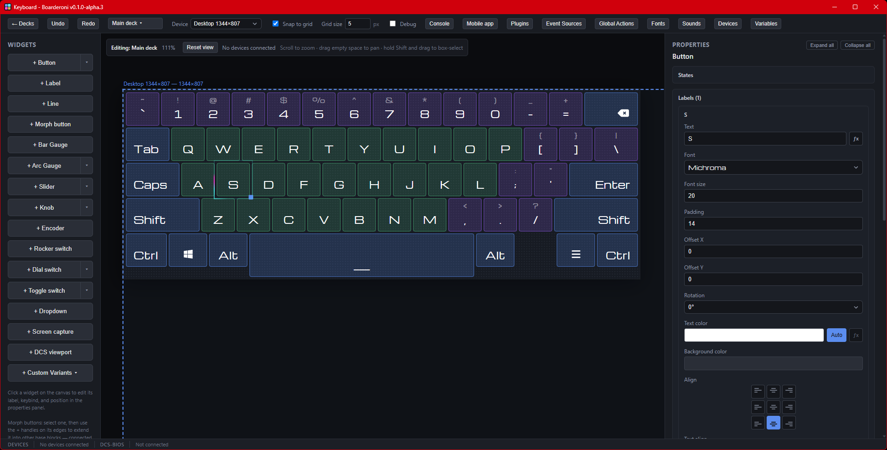

# Boarderoni

Design button/macro dashboards on desktop, drive them from a mobile WebView
client over your local network. Built for simpit/HOTAS panels, stream-deck
style macro boards, and DCS World cockpit exports.

See [docs/USER_MANUAL.md](docs/USER_MANUAL.md) for how to use the app, or
[docs/CONTRIBUTING.md](docs/CONTRIBUTING.md) for the codebase layout and
plugin-authoring walkthrough.

## Disclaimer

This project was built almost entirely with Claude. I had a lot of ideas
for what a better dashboard/macro editor could look like, but not the time
to build it all myself — so I used my own software engineering background
(Node.js) to guide the design and test every step along the way, rather than
writing most of the code by hand.

## Status: Alpha

Boarderoni works and is actively used, but it's pre-1.0 and under active
development:

- The dashboard file format can still change between versions (a migration
  path is kept for existing saves, but always back up a deck you care about
  before updating).
- Windows only for now — several plugins (Windows Audio, some DCS-BIOS/
  input pieces) depend on Windows-specific native modules; other platforms
  aren't tested and may not work at all. Testing so far has only been done
  on Windows 11 — other Windows versions are untested, not confirmed working.
- No auto-update yet — you'll need to grab new installers manually from
  [Releases](../../releases) for now.
- Expect rough edges, and please open an issue if you hit one.

## Features

- **Visual editor** — drag/drop/resize/rotate widgets, multi-select, grouping,
  undo/redo, snap-to-grid, a live debug console for expression output.
- **15 widget types** — Button, Morph Button, Bar Gauge, Arc Gauge, Adjuster
  Slider, Adjuster Knob, Encoder, Rocker Switch, Dial Switch, Toggle Switch,
  Dropdown, Screen Capture, DCS Viewport, Label, Line.
- **Custom widget variants** — save your own styled widget (or multi-widget
  group) as a reusable preset, alongside a set of built-in aircraft-panel-
  style presets.
- **Expressions everywhere** — nearly every visual property (color, text,
  position, value, active state, ...) can be a small JS expression reading
  live variables instead of a fixed value.
- **Global actions** — deck-wide if/then rules that fire on their own when a
  watched variable changes, with no widget and no connected device involved.
- **Custom fonts**, multiple screens per deck (sub-decks) with in-editor
  navigation, and a live variables system synced in real time to every
  connected device.
- **Mobile companion app** — an Android WebView client (source in
  [`android/`](android/)) that pairs with the desktop over your local
  network (mDNS auto-discovery, per-device approval), no cloud/account
  required. Not on the Play Store — build it yourself with the Gradle
  wrapper in `android/` or download it from the [Releases](../../releases) page.
- **Plugins** (event sources + actions):
    - **DCS-BIOS** — read/write DCS World cockpit state over its UDP export.
    - **DCS Viewports** — multi-monitor MFCD/cockpit display export.
    - **Windows Audio** — device and per-application volume/mute, on a
      dedicated worker thread so it never blocks the UI.
    - **Screen Capture + OCR** — stream or poll a screen region, optionally
      recognizing text/numbers from it.
    - **REST Data Sources** — poll or receive from any HTTP API.
    - **Date & Time** — clock/calendar values for labels and expressions.

## License

[PolyForm Noncommercial 1.0.0](LICENSE) — free to use, modify, and share for
any noncommercial purpose (personal, hobby, research, nonprofit/educational/
government use). Commercial use requires a separate arrangement with the
copyright holder.

## Support

If Boarderoni's useful to you, consider supporting development:

- **Crypto**:
    - BTC: `34SkUhyuGPFKDYu95UAVwegnTFQcV39wfs`
    - ETH: `0x18D19d8cD012b02068F4580849f6873C1EB8360C`
