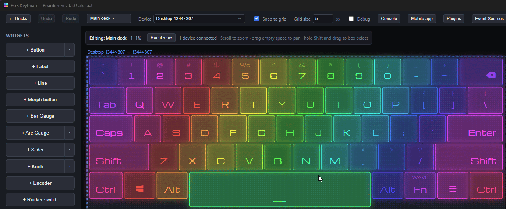
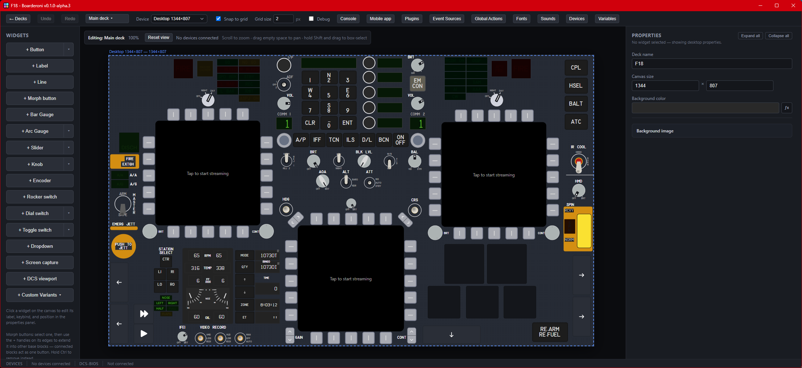
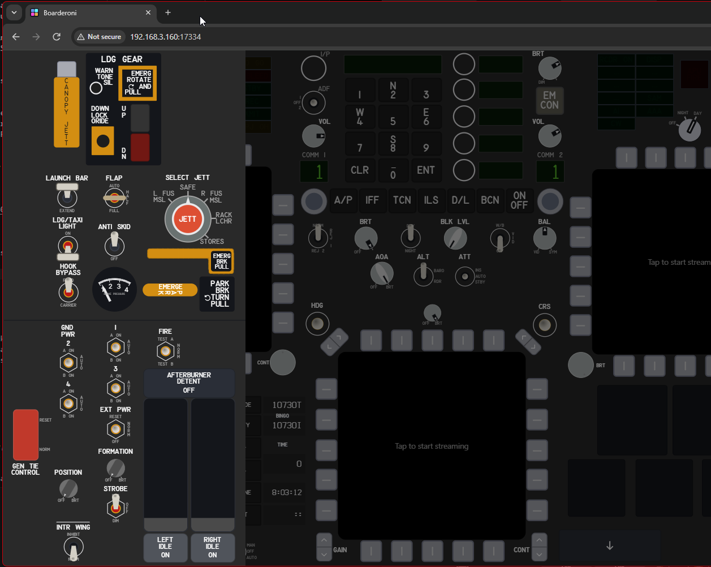
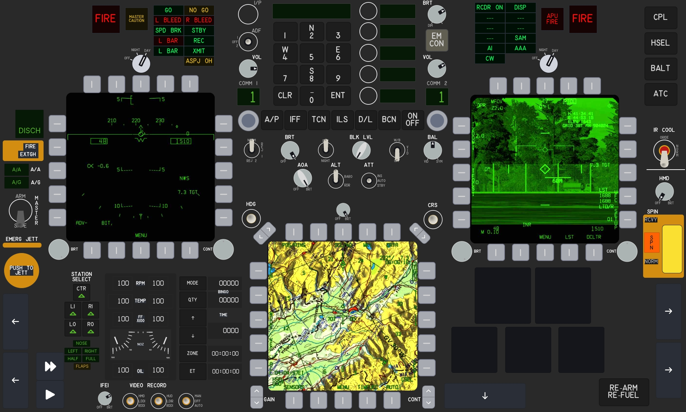

# Examples

Two real decks, exported from the app, to import and pull apart. Download
one and use **Import** in the deck picker (see
[Decks](USER_MANUAL.md#3-decks)).

| Deck                             | File                                                             | Needs                                                   |
| -------------------------------- | ---------------------------------------------------------------- | ------------------------------------------------------- |
| [RGB Keyboard](#rgb-keyboard)    | [`RGB-Keyboard.boarderoni`](../examples/RGB-Keyboard.boarderoni) | Nothing — works as soon as it's imported                |
| [F/A-18C Hornet](#fa-18c-hornet) | [`F18.boarderoni`](../examples/F18.boarderoni)                   | DCS World with DCS-BIOS; DCS Viewports for the displays |

---

## RGB Keyboard



A full-size, 61-key on-screen keyboard with animated RGB lighting.

### How it works

Every key is a **Button** with two actions: **press** sends a keypress
with mode **down**, and **release** sends the same key with mode **up**. So
the key is held for as long as your finger is on it, which is what games
and key-repeat expect. Modifiers (Shift, Ctrl, Alt, Win) are keys like
any other.

Each key has a **Default** and a **Clicked** state, so it lights up a
little brighter while held. The keycap legends are two labels per key: the main character
at the bottom, and its shifted character at half opacity at the top. The
Backspace, Win and Menu keys use icon labels (`{{icon:fa-delete-left}}`
and so on) instead of text.

### RGB lighting

The lighting has six modes, cycled with the **Fn** key: **wave**,
**cycle**, **breathe**, **night**, **cyberpunk**, **ripple**, then **off**.
Fn's top label shows the current mode. It's built from three parts, none
of them a special feature — just variables, a global action and
expressions:

1. **A clock.** A **Date & Time** event source maps its `unixMs` field to
   the variable `rgb_t`. That updates about four times a second, and each
   update is what drives the next frame.
2. **An engine.** A [global action](USER_MANUAL.md#14-global-actions)
   named **RGB engine** watches `rgb_t`, `rgb_on` and `rgb_mode`, and fires
   on every change. Its single **Update state** step holds a table of each
   key's centre position on the canvas, works out a color for every key
   from the current mode, the time and that position, and returns them all
   at once as `rgb_k0` … `rgb_k60` (a hex color each, or empty for off).
   The modes are just different formulas:
    - **wave** — hue shifts with time and with the key's x/y position, so a
      rainbow rolls diagonally across the board.
    - **cycle** — every key the same hue, slowly rotating.
    - **breathe** — slow hue change, with brightness pulsing on a sine wave.
    - **night** — dim deep blue/indigo with a slow shimmer.
    - **cyberpunk** — magenta/cyan diagonal bands, with the odd key
      flickering yellow.
    - **ripple** — a ring expands from the last key you pressed. When
      nothing's been pressed for a while, it starts ripples from random
      keys on its own.

    `rgb_speed` scales the animation speed.

3. **The keys.** Every key's background, border, glow and label colors are
   [expressions](USER_MANUAL.md#8-variables) that read its own variable,
   falling back to the key's normal color when the lighting is off:

    ```js
    return variables.rgb_k0 || "#8b5be2";
    ```

    For ripple mode, each key also has one extra **Update state** step on
    press that records where it is and when it was pressed:

    ```js
    return { rgb_rx: 180, rgb_ry: 40, rgb_rt: variables.rgb_t };
    ```

The **Fn** key's press is a small **Update state** step that moves
`rgb_mode` on to the next mode in the list, or sets `rgb_on` to false for
**off**. Its mode label is a text expression reading those same two
variables.

Because the engine is a global action, the colors are worked out once on
the desktop and synced to every connected device, rather than every
tablet running its own animation.

---

## F/A-18C Hornet

> **Work in progress.** This deck is far from complete: some panels are
> only partly built, some controls are missing, and a few buttons are
> still placeholders. It's included as a real-world example of the
> techniques below, not as a finished cockpit.



A cockpit panel for the DCS World F/A-18C: the front instrument panel on
the main screen, plus five side panels that open over it.

### What you need

- **DCS World** with the F/A-18C, and **DCS-BIOS** installed (see
  [DCS-BIOS setup](USER_MANUAL.md#13-dcs-bios-setup-optionaladvanced)).
- **DCS Viewports**, for the three live display streams (see
  [Plugins & event sources](USER_MANUAL.md#9-plugins--event-sources)).
  Everything else works without it.
- The deck bundles the **MS33558** font and one click sound, and imports
  them for you.

### How it's built

**Data in.** Two **DCS-BIOS** event sources: one for the `FA-18C_hornet`
module (about 500 fields mapped to variables) and one for `CommonData`
(altitude, heading, position and so on). Every light, readout and switch
position on the deck is driven by those variables.

**Layout.** The main screen holds the front panel:

- The **UFC**: keypad, option select buttons, comm channels, and the
  scratchpad.
- The **IFEI**, the engine display.
- The left, right and centre displays (DDIs and AMPCD), each a **DCS
  Viewport** widget streaming the real in-game display, surrounded by its
  bezel push buttons.
- Master arm, HUD controls, the warning/caution lights, and a few sim
  buttons (ATC, rearm/refuel and two others) that send DCS's own keyboard
  shortcuts rather than DCS-BIOS commands.

Arrow buttons around the edges open the side panels as **sub-deck
overlays** that open from the left, right or bottom edge:

- **Left Panel 1** — landing gear, flaps, launch bar, exterior lights,
  jettison, parking brake, and the throttle idle and afterburner detents.
- **Left Panel 2** — fuel, comms, IFF, APU/engine crank, FCS, OBOGS, and
  rudder trim.
- **Right Panel 1** — caution lights, wing fold and hook.
- **Right Panel 2** — electrical, ECS, anti-ice, interior lights, sensors,
  KY-58, canopy and the ejection seat.
- **Below Panel** — RWR and countermeasures.



**Techniques worth copying:**

- **Buttons that show the cockpit's state.** A button presses a DCS-BIOS
  command, and its **active state** expression shows what the cockpit
  actually did, not just the tap:

    ```js
    return variables.UFC_1 !== 1 ? "Default" : "Clicked";
    ```

- **Switches mapped to cockpit positions.** A toggle, rocker or dial
  switch's active position expression maps the DCS-BIOS value to a
  position name, so moving the switch in the cockpit moves it on the
  tablet too:

    ```js
    const map = { 2: "Top", 1: "Middle", 0: "Bottom" };
    return map[variables.MASTER_ARM_SW];
    ```

    Where a dial's positions aren't simply 0, 1, 2 in order, an **argument
    expression** maps the chosen position back to the value DCS-BIOS
    expects.

- **Live text.** The UFC scratchpad and option displays, and the IFEI
  readouts, are labels with text expressions, using the built-in Hornet
  display font. The IFEI's segments use visibility expressions tied to
  DCS-BIOS's own "is this shown" fields, so they blank out when the real
  display does.
- **Indicator lights.** DCS-BIOS exposes every cockpit light as a
  variable ending in `_LT` (`MASTER_CAUTION_LT`, `FIRE_LEFT_LT`,
  `FLP_LG_NOSE_GEAR_LT`, the caution lights, the RWR panel, ... — 53 of
  them in this deck). Around 36 widgets watch one, lighting up exactly
  when the real one does. Most use a label's text color expression, which
  can return an opacity along with the color, so the legend fades to a
  faint "unlit" look rather than disappearing:

    ```js
    return { opacity: variables.FLP_LG_NOSE_GEAR_LT ? 100 : 9, color: "#56b728" };
    ```

    Others use background and glow color expressions instead, for example
    `return variables.SPIN_LT ? '#ff6205' : '#230d00'`. Because they follow
    the cockpit rather than the tablet, flipping the **Lights Test** switch
    (Right Panel 2) in the jet lights up a whole lot of them at once, which is
    also a quick way to check they're wired correctly:

    

- **Guards and handles.** Switch guards open and close with
  `guardOpenExpr` (for example the spin recovery cover), and handles like
  the emergency gear and parking brake rotate with a rotation expression.
- **Custom logic.** A few controls use **Update state** steps instead of
  a plain command, for example the throttle slider's idle handling and the
  afterburner detent button, which toggles a variable.
- **Feedback.** Many controls play a short click sound on the desktop
  when pressed.

With this deck open and the [MCP server](USER_MANUAL.md#15-ai-agents-mcp)
on, an AI agent can read every one of those ~500 cockpit variables and
send DCS-BIOS commands too — see "Accidentally, a DCS-BIOS MCP server"
in that section.

---

## Want more?

Every technique above is something you can set up from the properties
panel. You can also have an AI agent build or change a deck for you; see
[AI agents (MCP)](USER_MANUAL.md#15-ai-agents-mcp).
