# Boarderoni User Manual

This is the end-user guide — how to build and use dashboards. If you're
looking for the codebase layout or how to write a plugin, see
[CONTRIBUTING.md](CONTRIBUTING.md) instead. For a field-by-field reference
of every widget's properties panel, see
[PROPERTIES_PANEL.md](PROPERTIES_PANEL.md).

Screenshots below are placeholders (temporary stock images) until real ones
are captured from the app.

## Table of contents

1. [Getting started](#1-getting-started)
2. [Viewing a dashboard on another device](#2-viewing-a-dashboard-on-another-device)
3. [Decks](#3-decks)
4. [The editor](#4-the-editor)
5. [Widgets](#5-widgets)
6. [Styling](#6-styling)
7. [Actions & event sequences](#7-actions--event-sequences)
8. [Variables](#8-variables)
9. [Plugins & event sources](#9-plugins--event-sources)
10. [Devices & approval](#10-devices--approval)
11. [Settings](#11-settings)
12. [REST webhook targets (optional/advanced)](#12-rest-webhook-targets-optionaladvanced)
13. [DCS-BIOS setup (optional/advanced)](#13-dcs-bios-setup-optionaladvanced)
14. [Global actions](#14-global-actions)
15. [AI agents (MCP)](#15-ai-agents-mcp)
16. [Troubleshooting / FAQ](#16-troubleshooting--faq)

---

## 1. Getting started

Boarderoni is a desktop app (Windows only for now) with two roles:

- The **desktop app** is where you design dashboards — the editor.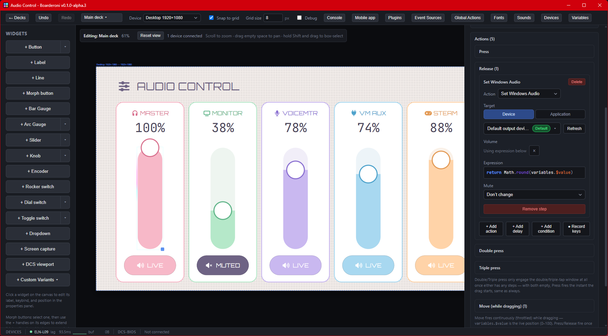

- Any other device (a phone, tablet, or second PC) can **connect to a
  desktop deck** and use it as a physical control panel. 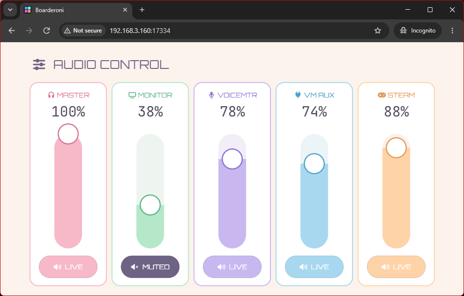

When you launch Boarderoni for the first time, you'll land on the **deck
picker** (see [Decks](#3-decks)) since there's nothing to open yet. Create a
deck, and it opens straight into the editor.

### Device settings & the 5-finger gesture

Every **client** (the live, full-screen, pressable rendering of a deck, as
opposed to the editor you design it in) — a browser on the desktop itself
or any phone/tablet — has its own small
settings panel: rename the device, toggle
"prevent screen timeout" on Android, force a refresh, or change which deck
it's showing.

To reach it:

- **Touchscreen**: press down with **5 fingers at once**, anywhere on the
  screen.
- **Desktop browser** (no touchscreen): press **Ctrl+I** (or **Cmd+I** on
  Mac).

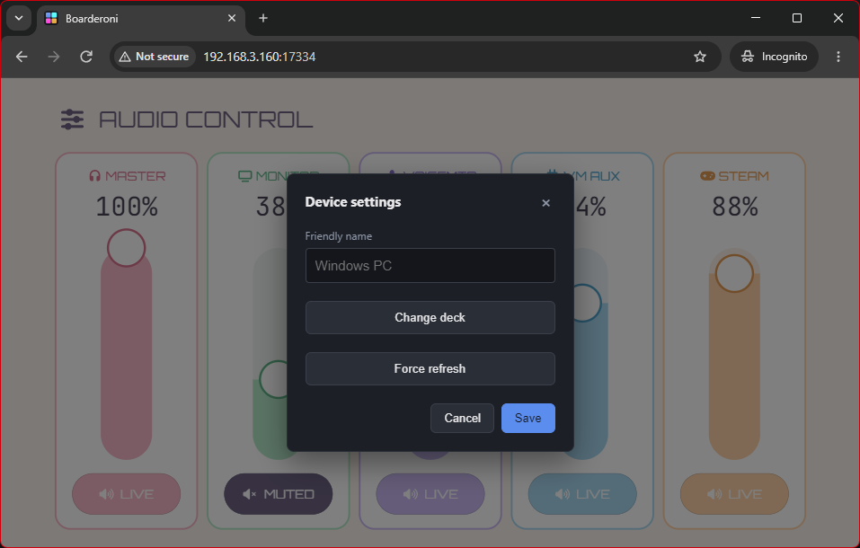

This works both while a deck is open and from the deck-list screen itself.

## 2. Viewing a dashboard on another device

You don't need the Android app to use Boarderoni from a phone or tablet —
**any device with a modern browser on the same local network** can open a
deck. The desktop app shows you a URL to open on the other device.

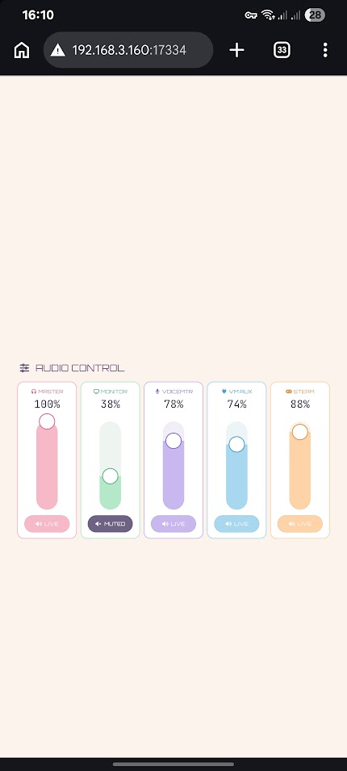

The **Android app** exists to make this more convenient, not because it's
required:

- It auto-discovers the desktop on your network (no typing an IP address).
- It reconnects automatically and remembers the last deck you had open.
- It's a free download - unfortunately not on Google Play. The source code for the app is on this repository however, if you want to assure yourself theres nothing fishy.

If you'd rather not use it, a kiosk-style browser app (for example, **Fully
Kiosk Browser** on Android) pointed at the same URL works just as well —
you'll just need to type in the address yourself and set up your own
full-screen/keep-awake preferences, which the dedicated app otherwise
handles for you.

## 3. Decks

A **deck** is one dashboard — its own set of widgets, variables, and
plugins. You can have as many as you like.

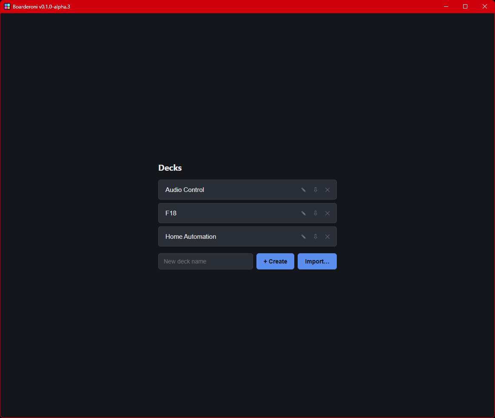

From the deck picker you can:

- **Create** a new, empty deck.
- **Rename** an existing deck.
- **Export** a deck to a `.boarderoni` file (includes its background
  image, if any) and **import** one back — handy for backups or moving a
  deck to another machine. Importing warns you about anything that won't
  carry over cleanly (e.g. a REST webhook target or screen-capture region
  that only existed on the original machine).
- **Delete** a deck (this cannot be undone).

## 4. The editor

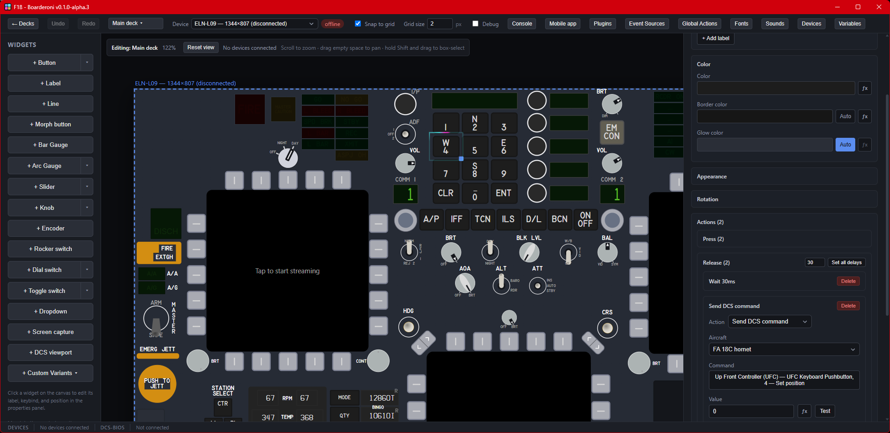

The editor has three main areas:

- **Palette** (left) — every widget type, plus any custom variants and
  built-in aircraft-panel presets you've saved. Click a widget to add it to
  the canvas.
- **Canvas** (center) — drag, resize, and rotate widgets. Multi-select with
  a marquee drag or Shift-click; right-click for a context menu (duplicate,
  group, save as variant, bring to front/back, ...). Snap-to-grid and grid
  size are both configurable.
- **Properties panel** (right) — every field for whatever's currently
  selected. Nothing is selected shows the deck's own background/canvas
  settings instead.

Undo/redo (Ctrl+Z / Ctrl+Y) covers essentially every edit. A debug console
along the bottom shows live output from any expression's `console.log`
calls, grouped so a fast-repeating one doesn't flood the panel.

## 5. Widgets

Boarderoni ships 15 widget types:

- **Button** / **Morph Button** — press/release actions, with independent
  Default/Clicked visual states.
- **Bar Gauge** / **Arc Gauge** — read-only value display.
- **Adjuster Slider** / **Adjuster Knob** — draggable value control.
- **Encoder** — an infinite-turn knob (turn CW/turn CCW actions instead of
  a fixed range).
- **Rocker Switch** / **Dial Switch** / **Toggle Switch** — multi-position
  switches, each position independently colored/labeled/actioned.
- **Dropdown** — a switch's positions, shown as a picker instead of laid
  out physically.
- **Screen Capture** — streams or polls a region of the desktop's own
  screen.
- **DCS Viewport** — routes a DCS World cockpit display (an MFCD, for
  example) to this widget.
- **Label** — static or expression-driven text.
- **Line** — a plain divider/decoration.

Every widget's full field list is documented in
[PROPERTIES_PANEL.md](PROPERTIES_PANEL.md).

## 6. Styling

- **Colors** — every color field can be a flat value or a small expression
  (click the **ƒx** button next to it) that reads live [variables](#8-variables)
  and returns a color.
- **Fonts** — a set of built-in fonts, plus your own uploaded custom fonts
  (Settings → Custom fonts).
- **Copy style** — right-click a widget → **Copy style**, then right-click
  another widget of the **same type** → **Paste style**. This carries
  colors, borders, fonts, and (for switches) per-position/per-state
  styling — matched by each state/position's **name**, not its position in
  the list, so renaming or reordering states doesn't scramble which style
  lands where. It never copies position/size, wiring, or variable bindings.
- **Custom variants** — right-click a widget (or a multi-selection) →
  **Save as variant** to add it to the palette as a reusable preset,
  alongside the built-in aircraft-panel-style presets.

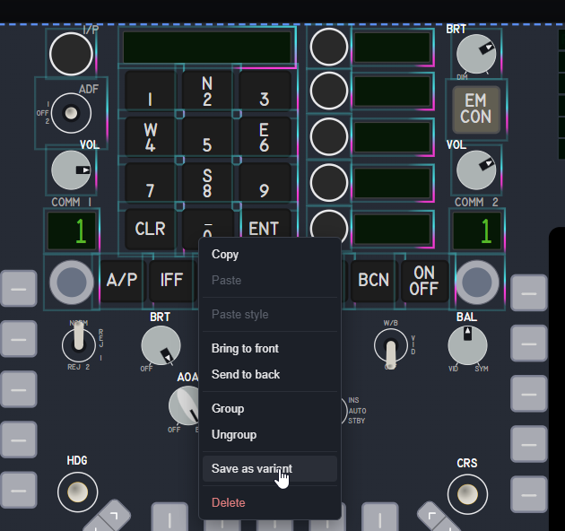

## 7. Actions & event sequences

Every button, switch position, and dropdown option can run a **sequence**
of steps when triggered (press, release, double-press, triple-press, or a
position/value change, depending on the widget).

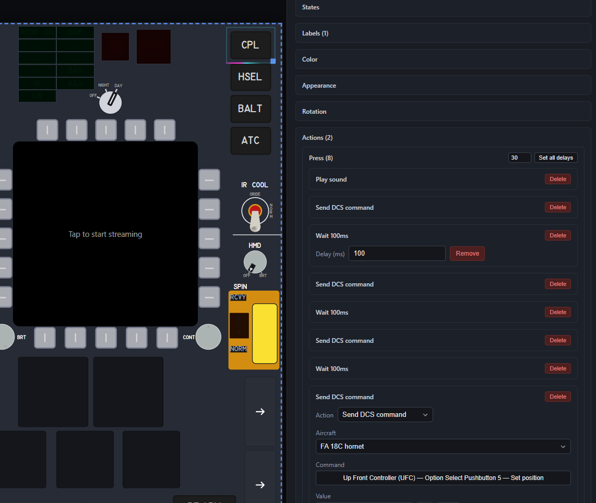

A step is one of:

- **Action** — the actual thing that happens. Kinds include: Keypress,
  Update state (run a small script that sets one or more variables),
  Navigate to screen / Open overlay / Close overlay (see sub-decks below),
  and whatever plugin-specific actions you have enabled (Send DCS command,
  Set Windows Audio, Call REST — see [Plugins](#9-plugins--event-sources)).
- **Delay** — pause for a fixed number of milliseconds before the next
  step.
- **Condition** — an expression; branches into its own "if true"/"if
  false" sub-sequences.

Steps can be reordered by drag, and a whole sequence can be recorded live
(press a key, and Boarderoni turns it into the right Keypress step) instead
of built by hand.

## 8. Variables

**Variables** are Boarderoni's live shared state — a named value any
widget's expressions, or any action, can read or write. They're created
automatically the first time something writes to them (a plugin's mapping,
an Update State action, an incoming REST field) — there's no separate
"declare a variable" step.

Anywhere you see an **ƒx** button, you're writing a small JavaScript
function body with every current variable available as `variables.NAME`.
For example:

```js
return variables.THROTTLE > 0.9 ? "#e05252" : "#3a3f4a";
```

The Variables panel (Toolbar) lists every variable currently in the deck
and its live value — useful for checking what a plugin or action is
actually producing.

## 9. Plugins & event sources

A **plugin** is a data source (and sometimes an action) you add to a deck.
Each kind is toggled on/off app-wide in [Settings](#11-settings); once
enabled, add an instance of it from the deck's **Event Sources** panel.

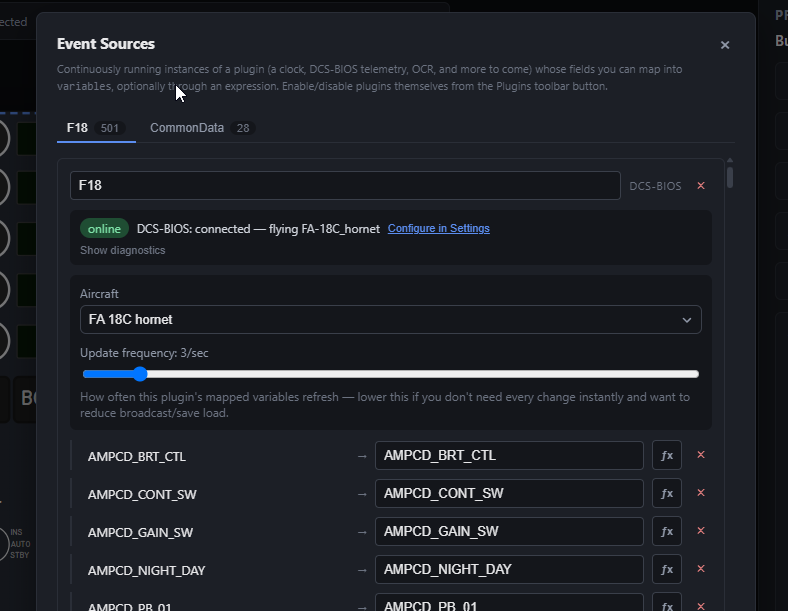

- **Date & Time** — clock/calendar fields for labels and expressions.
- **Random** — a random-number generator, mainly useful as a template for
  writing your own plugin.
- **REST Data Sources** — Boarderoni runs a small HTTP listener; anything
  POSTed to it (with the right bearer token) maps into this deck's
  variables. Good for pulling data in from an external script, tool, or
  webhook.
- **DCS-BIOS** — reads (and, via a button's Send DCS command action,
  writes) live DCS World cockpit state. See [DCS-BIOS setup](#13-dcs-bios-setup-optionaladvanced).
- **Windows Audio** — read and control system/per-application volume and
  mute.
- **Screen Capture (+ OCR)** — stream or poll a screen region, optionally
  reading text/numbers out of it.
- **DCS Viewports** — exports DCS cockpit displays (MFCDs, etc.) to their
  own monitor/window, for a Boarderoni DCS Viewport widget to show.

Each plugin instance's own field(s) get mapped into named variables from
its Event Sources entry — the same "field → variable" mapping shape every
plugin kind shares, with an optional expression to transform the raw value
first.

## 10. Devices & approval

Any device that connects to a deck (other than the desktop editor itself,
which is always trusted) needs to be **approved** the first time, so a
random device on your network can't just watch or control your dashboard.

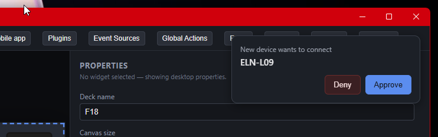

- A pending device shows a banner in the editor — **Approve** or **Deny**
  it there.
- Approved devices can be renamed (or from the device's own [5-finger
  settings](#1-getting-started)) and revoked later from the same list.

## 11. Settings

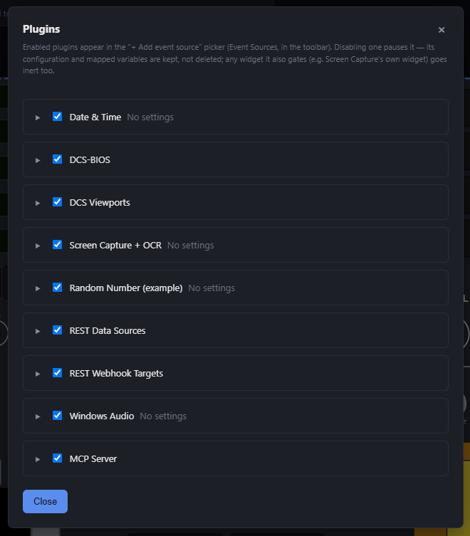

- **Plugins** — enable/disable each plugin kind app-wide. Disabling one
  stops its data/actions everywhere, including any widget already using it
  (it just goes inert rather than breaking).
- **Custom fonts** — upload your own fonts for use anywhere a font picker
  appears.
- Kind-specific settings live here too where they apply (DCS-BIOS's docs
  folder and multicast address, DCS Viewports' install paths, REST Data
  Sources' and REST Webhook Targets' own lists).

## 12. REST webhook targets (optional/advanced)

_Skip this section unless you specifically want a button to call an
external HTTP API._

A **REST webhook target** (Settings → REST Webhook Targets) is a named,
reusable outgoing HTTP request: a method (GET/POST/PUT/PATCH/DELETE), a
URL, optional headers, and — for anything but GET — a payload template.
A button's **Call REST** action picks one by name and fills in a value (or
expression) for each `{{placeholder}}` token found in the template or
headers.

Templates are a **plain text substitution** — write the exact text you
want sent, `{{name}}` and all, quotes included:

```
{"speed": {{speed}}, "label": "{{label}}"}
```

If `speed` resolves to `250` and `label` to `Cruise`, the request body
becomes `{"speed": 250, "label": "Cruise"}`. There's no validation beyond
that — a malformed result is sent exactly as constructed, so double-check
your quoting.

## 13. DCS-BIOS setup (optional/advanced)

_Skip this section unless you're building a DCS World cockpit panel._

DCS-BIOS reads and writes DCS World's own cockpit state over UDP. To use
it:

1. Install the [DCS-BIOS](https://github.com/DCS-Skunkworks/dcs-bios) Lua
   export scripts into your DCS `Scripts\Export.lua`, if you haven't
   already (DCS-BIOS's own installer/docs cover this).
2. In Boarderoni's Settings, point DCS-BIOS at that installation's `doc`
   folder (used to build the per-aircraft command/field catalog) and set
   the multicast address/port to match your `Export.lua` config.
3. Add a **DCS-BIOS** event source to a deck to map cockpit fields into
   variables, or use a button's **Send DCS command** action to write to
   one (flip a switch, push a button, etc.) — both pick from the same
   per-aircraft catalog, searchable by name.

## 14. Global actions

Every action covered so far hangs off a widget — someone presses a button,
turns a knob, flips a switch. **Global actions** are the deck-wide version:
if/then rules that aren't attached to any widget and fire on their own when
your data changes.

Open them from **Global Actions** in the toolbar. Each rule has four parts:

- **Runs when these change** — the variables the rule watches. The rule only
  re-checks when one of these changes, which is what keeps a deck fed by a
  fast source (DCS-BIOS can update hundreds of fields a second) from
  re-running every rule on every update. If you've used React, this is the
  same idea as a `useEffect` dependency array.
- **Condition** — a JS function body returning true or false, with the usual
  `variables.NAME` access.
- **Fire** — _when the condition becomes true_ runs the actions once on the
  false → true transition, then re-arms when it goes back to false. _Every
  time a watched variable changes_ runs them on every change for as long as
  the condition holds.
- **Actions** — the same action/delay/condition sequence editor used for
  widget events, so anything a button can do, a rule can do.

For example, a low-fuel warning: watch `fuel`, condition
`return variables.fuel < 1000;`, and an Update State action setting
`{ fuel_warning: true }` that a label's color expression reads.

Two things worth knowing:

- Rules run **in the app itself**, not on a connected device — so they fire
  whether or not anyone has the deck open on a tablet, and they fire once
  rather than once per connected device.
- A rule can set a variable another rule watches, and that second rule runs
  immediately in the same pass. Rules are evaluated **top to bottom in the
  order listed**, so use the ↑/↓ buttons if one needs to run before another.
  If two rules end up undoing each other forever, Boarderoni stops after ten
  rounds and logs a message to the debug **Console** naming the variables
  still in play, rather than hanging.

If the condition reads a variable that isn't in the watch list, the modal
flags it with an **Add it** button — the rule would otherwise look correct
and silently never fire, which is a miserable thing to debug.

## 15. Troubleshooting / FAQ

- **I see a lot of DCS World references — is this only for DCS?** — No.
  Boarderoni is a general-purpose dashboard/control-panel tool: widgets,
  variables, event sources, REST/webhook actions, and everything else work
  the same regardless of what's driving them. DCS-BIOS and DCS Viewports are
  just one plugin (and one export flow) among several — see
  [Plugins & event sources](#9-plugins--event-sources) for the full list.
  The docs lean on DCS examples mainly because that's what the examples were
  built and tested against, not because of any hard dependency.
- **Will updating Boarderoni break my saved decks?** — The dashboard file
  format can still change between versions, since the app is pre-1.0. A
  migration path is kept for existing saves, but always back up a deck you
  care about before updating, just in case.
- **Does Boarderoni send any data outside my network, or need an account?**
  — No. Everything runs locally over your own network — no cloud service,
  no account, no external server involved. The desktop app and any
  connected devices (phone, tablet, second PC) talk to each other directly
  over your LAN.
- **What's the difference between the "editor" and the "client"?** —
  The editor is where you design a deck — drag/drop/resize widgets, edit
  properties, and so on. The client is the live, full-screen,
  pressable rendering of that same deck, as opposed to the design surface.
  The desktop app itself can show either; any other connected device only
  ever sees the client.
- **Why did starting a second Boarderoni window/instance fail?** — Only one
  instance can run at a time — a second one shows "Boarderoni is already
  running" and exits, since both would otherwise try to bind the same
  server port and collide over the same local data directory. Close the
  first instance before starting another.
- **A device won't connect** — check it's on the same local network as the
  desktop, and that it's been approved (see [Devices & approval](#10-devices--approval)).
- **An action silently does nothing** — check the debug console at the
  bottom of the editor; most action failures (a disabled plugin, a deleted
  REST target, a bad expression) show up there as a toast and a logged
  error. Placing a widget whose action depends on a currently-disabled
  plugin gives no warning at placement time yet — it just throws
  `"<Plugin> is disabled in Settings"` the first time it fires, so check
  Settings if an action you just added does nothing.
- **A plugin's fields aren't available** — confirm that plugin kind is
  enabled in Settings.
- **I changed something and it's not showing up on a connected device** —
  changes normally sync live over the network; a stuck device usually just
  needs the app restarted or the deck reopened.
